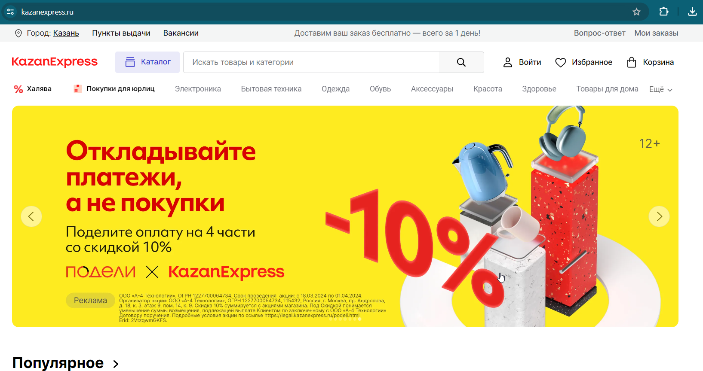
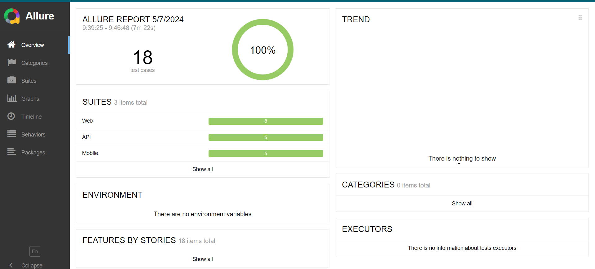
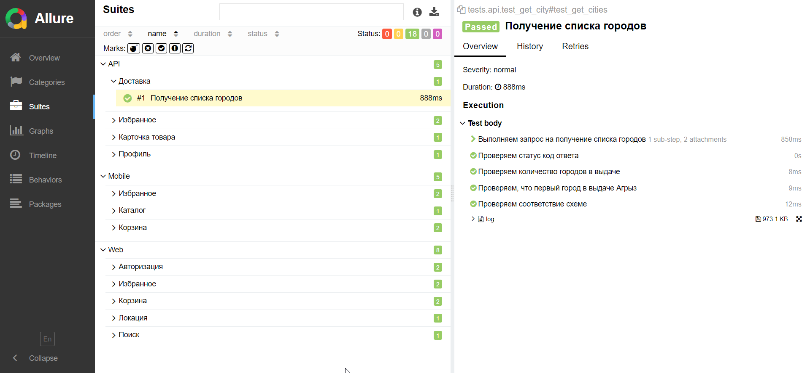
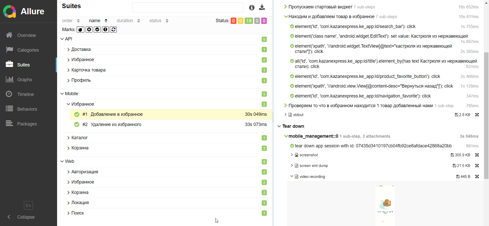
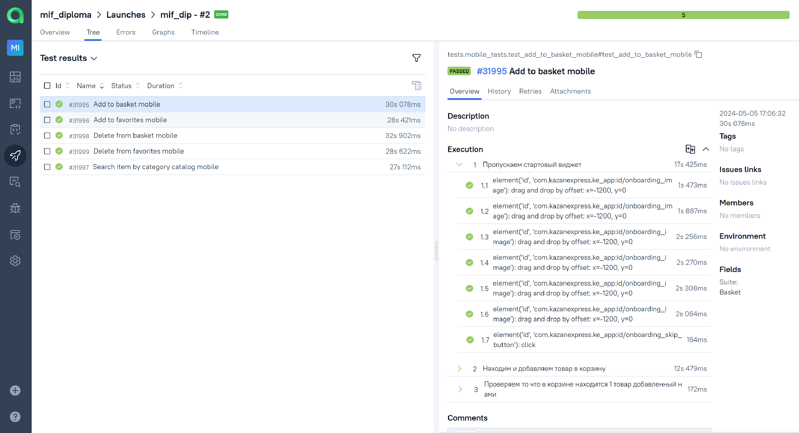
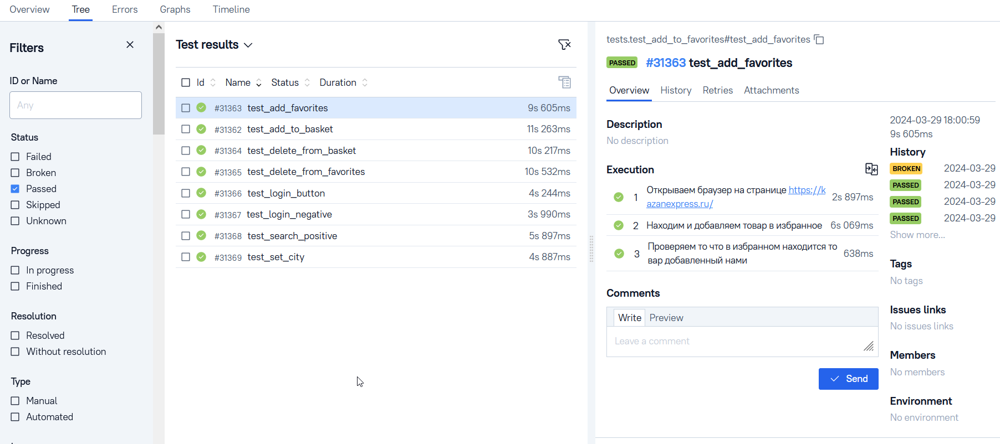
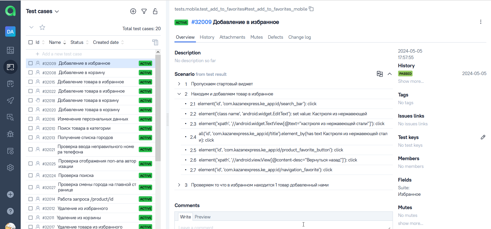
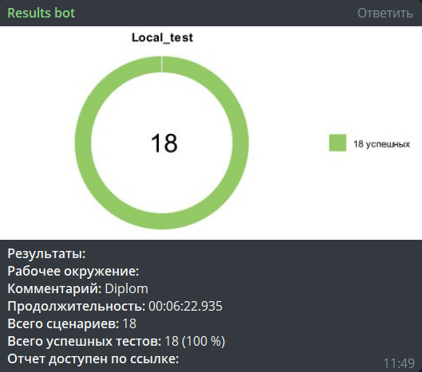
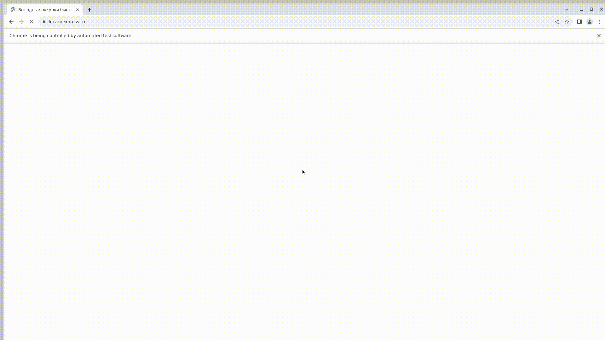

# Проект по автоматизации тестирования сайта и мобильного приложения KazanExpress.ru

> <a target="_blank" href="https://kazanexpress.ru/">Ссылка на сайт</a>

----
### Проект реализован с использованием:
         


----

### Особенности проекта

* Оповещения о тестовых прогонах в Telegram
* Отчеты с видео, скриншотом, логами, исходной моделью разметки страницы
* Сборка проекта в Jenkins
* Отчеты Allure Report
* Интеграция с Allure TestOps
* Автоматизация отчетности о тестовых прогонах и тест-кейсах в Jira
* Запуск web/UI автотестов в Selenoid
* Запуск мобильных автотестов в Browserstack

 ### Список проверок, реализованных в web/UI автотестах

- [x] Смена города выполняется
- [x] Поиск по сайту выполняется
- [x] Открывается по-ап авторизации
- [x] Проверка валидации ввода номера телефона
- [x] Добавление товара в избранное
- [x] Удаление товара из избранного
- [x] Добавление товара в корзину
- [x] Удаление товара из корзины

----
 ### Список проверок, реализованных в API автотестах

- [x] Запрос на список городов, доступных для доставки
- [x] Запрос на получение карточки товара
- [x] Запрос на добавление товара в избранное
- [x] Запрос на удаление товара из избранного
- [x] Запрос на изменение персональных данных в профиле покупателя

____

 ### Список проверок, реализованных в mobile автотестах

- [x] Добавление товара в избранное
- [x] Удаление товара из избранного
- [x] Добавление товара в корзину
- [x] Удаление товара из корзины
- [x] Поиск товара в каталоге

____

### Локальный запуск
> Для локального запуска с дефолтными значениями необходимо выполнить команду:
```
python -m venv .venv
source .venv/bin/activate
pip install poetry
poetry install --no-root
pytest .
```
----
### Удаленный запуск автотестов выполняется на сервере Jenkins
> <a target="_blank" href="https://jenkins.autotests.cloud/job/mif_kaz_project">Ссылка на проект в Jenkins</a>
#### Для запуска автотестов в Jenkins

1. Открыть <a target="_blank" href="https://jenkins.autotests.cloud/job/mif_kaz_project">проект</a>
2. Нажать кнопку `Build with parameters`
3. Выбрать тесты для запуска
4. Результат запуска сборки можно посмотреть в отчёте Allure, в запуске Allure TestOps
----

### Параметры сборки

>
> ><code>tests</code> – запускает все тесты проекта api, mobile, web.
>
> ><code>tests/api_tests</code> – запускает только api тесты.
>
> ><code>tests/mobile_tests</code> – запускает только mobile тесты.
> 
> ><code>tests/web_tests</code> – запускает только web тесты.
### Allure отчет


#### Общие результаты

#### Список тест кейсов в Allure 

#### Пример тест кейса в Allure с логированием и attachments 

#### Примеры запуска в Allure TestOps



#### Список тест кейсов в Allure TestOps

#### Нотификация в Telegram

#### Видео прохождения теста Web

#### Видео прохождения теста Mobile


